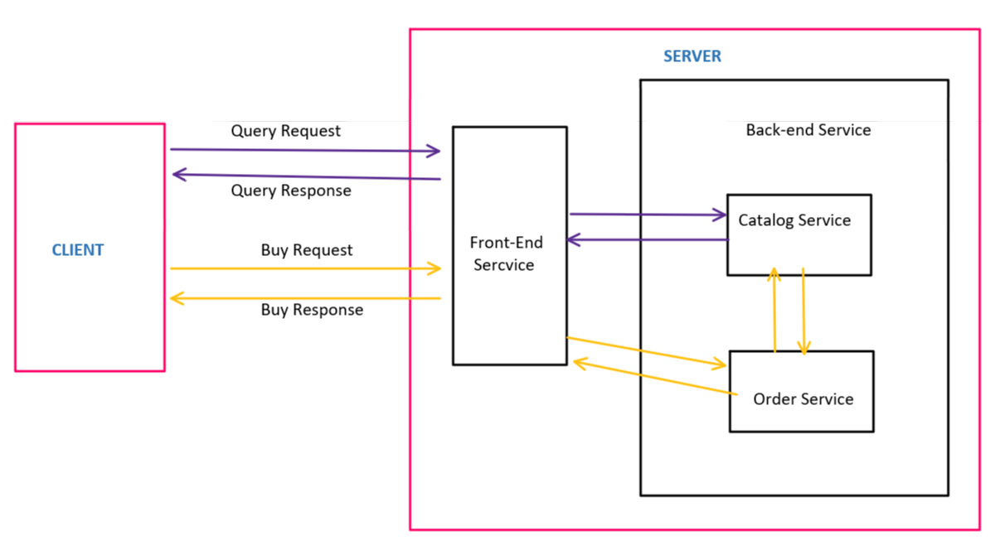
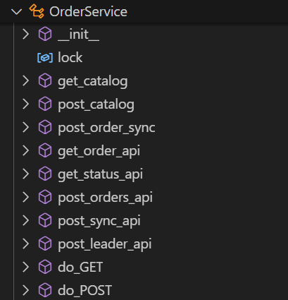

## 1. Motivation
  In this project, we have engineered a multi-tier, microservice-based distributed server application. We have delved into crucial topics such as caching, replication, and consistency, gaining invaluable insights into optimizing data storage and retrieval mechanisms. Additionally, we have explored the pivotal concepts of fault tolerance and high availability, essential components in building robust and resilient systems. Moreover, the project offers a practical avenue for understanding the intricacies of deploying applications on cloud platforms, enabling us to navigate the dynamic landscape of cloud computing.

## 2. Goals

1.  Design distributed server applications using a multi-tier
    architecture and microservices.

2.  Design virtualized applications.

3.  Design interfaces for web applications.

4.  Learn how to implement a REST API server.

5.  Learn about caching, replication, and consistency.

6.  Learn about the concepts of fault tolerance and high availability.

7.  Learn about how to deploy your application on the cloud. Optionally
    learn about Paxos and Raft

## 3. Architecture Overview



Here the order service is abstracted as a single service but in implementation it is a set of 3 replicas with a leader, that are in sync. 

## 4. Component Details

### **4a. FrontEnd** 


**[APIs Exposed:-]**

-   **[get_products_api:]{.underline} GET /products/\<product\>\
    **This API is used by client to fetch product details for a given
    product.

-   **[get_orders_api:]{.underline} GET /orders/\<order_number\>\
    **This API is used by client to get order details for a given order
    number.

-   **[post_order_api:]{.underline} POST /order\
    **This API is used by client to place an order.

-   **[post_cache_api:]{.underline} POST /cache\
    **This API is used by catalog service to remove a product's details
    from cache whenever an order is placed (product quantity is updated)
    or a product is restocked.

**[Caching Implementation:]**

To improve the responsiveness of the application, we\'re adding a
caching mechanism to the front-end service. This cache acts like a
temporary storage for frequently accessed toy information.\
The front-end server starts with an empty cache, ready to learn about
toys.

-   **Checking the Cache First:**

-   Whenever a toy query arrives, the front-end service first looks for
    the information in its cache.

    -   **If Found:** If the toy data is in the cache, it\'s retrieved
        immediately, providing a speedy response.

    -   **If Missing:** If the toy data isn\'t in the cache (a \"cache
        miss\"), the request is sent to the catalog service for the
        latest information.

-   Once received from the catalog service, the toy data is stored in
    the cache for future use, making subsequent lookups for the same toy
    much faster.

-   **Keeping the Cache Up-to-Date**


-   **Catalog Server Sends Updates:** Whenever a toy is purchased or
    restocked, the catalog server proactively sends an \"invalidation
    request\" to the front-end service.

-   **Cleaning Up the Cache:** Upon receiving an invalidation request,
    the front-end service removes the corresponding toy data from its
    cache. This ensures the cache reflects the latest inventory levels.

We have implemented a **thread-safe Least Recently Used (LRU) cache**,
which is a data structure that maintains a fixed-size collection of
items. It evicts the least recently used item when the cache reaches its
capacity. The front-end service initialises the LRUCache with an initial
capacity of 10 items.

-   **Design Overview of LRU Cache:**
-   The **LRUCache_Class** class is initialized with a specified
    capacity.

-   It utilizes a dictionary (**cache**) to store key-value pairs and a
    list (**usage_order**) to maintain the order of keys based on their
    usage.

-   The implementation uses a lock (**lock**) from the **threading**
    module to ensure thread safety.


-   **Methods:**

1.  **get(self, key)**: Retrieves the value associated with the given
    key from the cache. If the key exists, it updates the usage order by
    moving the accessed key to the end (representing it as the most
    recently used) and returns the corresponding value. If the key does
    not exist, it returns -1.

2.  **put(self, key, value)**: Adds or updates a key-value pair in the
    cache. If the key already exists, it updates the value and moves the
    key to the end of the usage order. If the cache is full, it removes
    the least recently used key from both the cache and the usage order.
    Then, it adds the new key-value pair to the cache and usage order.

3.  **remove(self, key)**: Removes a key-value pair from the cache based
    on the given key. It updates the usage order by removing the key if
    it exists.

-   **Thread Safety:**

-   To ensure thread safety, each method is wrapped with a **with
    self.lock** block, allowing only one thread to access the cache at a
    time. This prevents data corruption or inconsistency caused by
    concurrent accesses.

**[Replication Implementation:-]**

To prevent order information loss in our toy store application due to
system crashes, we\'ll replicate the order service. This means creating
multiple copies of the service running simultaneously.

In our application, three replicas of the order service are launched.
Each replica has a unique identifier and its own dedicated database file
for storing order details. Among these replicas, one acts as the leader,
while the others serve as followers.

-   **Front-End Service - Choosing the Leader:**

-   Upon startup, the front-end service reads a configuration file
    containing the ID and address of each order service replica.

-   It then \"pings\" the replica with the highest ID to check if it\'s
    responding.

    -   If responsive, it broadcasts a message to all replicas,
        announcing the leader\'s selection based on its ID.

    -   If unresponsive, the front-end service attempts to contact the
        replica with the second-highest ID and repeats the process until
        a leader is identified.

-   **Handling Requests:**

-   Once a leader is chosen, the front-end service only sends purchase
    requests and order queries to the leader replica. This ensures all
    order information is centralized and updated consistently.

### **4b. Catalog Service** 

**HTTP Server Setup and Customization:**
Similar to the frontend.py code, this module sets up an HTTP server, but it’s specifically tailored for catalog-related operations. The server is customized using the CatalogService class, extending BaseHTTPRequestHandler, which handles GET and POST requests for catalog information.

**Concurrency Control:**
The ThreadPoolHTTPServer class extends the base class ThreadingMixIn class incorporates a ThreadPoolExecutor to manage multiple incoming requests concurrently. This design choice ensures efficient resource utilization and responsiveness under varying workloads.

**Data Persistence:**
The load_disk class is responsible for loading catalog data from a disk file (catalog.csv) upon server initialization and saving any changes back to the disk upon server shutdown. Catalog data is stored in memory using the Memory_attributes class, providing a central data structure accessible across the server instance.

**Request Handling:**
The CatalogService class defines methods (do_GET and do_POST) to handle HTTP GET and POST requests, respectively. These methods interact with the catalog data stored in memory to retrieve or modify product information. Concurrency control is enforced using a thread lock (self.lock) to ensure thread safety during data access and manipulation operations.

**Server Initialization and Shutdown:**
The run_server function initializes the catalog server, loads catalog data from disk, and starts serving
requests indefinitely. Upon server shutdown (triggered by a keyboard interrupt), changes to catalog
data are saved back to the disk file.

### **4c. Order Service**

{width="2.126890857392826in"
height="2.210094050743657in"}

**[APIs Exposed:-]**

-   [get_order_api:] GET /\<order_number\>\
    This API is used by front-end service to fetch order details for a
    given order number.

-   [get_status_api:] GET /status\
    This API is used by front-end service to check if the order
    service is alive and responsive.

-   [get_last_orderapi:] GET /last\
    This API is used by replicas to get last order number.

-   [get_status_api:] GET /syncfrom\
    This API is by replicas to sync from a particular order number.

-   [post_orders_api:] POST /orders\
    This API is used by front-end service to place an order.

-   [post_sync_api:] POST /sync\
    This API is used by order service to sync the order_logs after
    other order replicas have placed orders. This order logs information
    is stored in memory.

-   [post_leader_api:] POST /leader\
    This API is used by front-end service to notify which order
    replica is the leader. This leader information is stored in memory.

## 4d. Fault Tolerance:

Fault tolerance is implemented in the following way:
- when a replica is started, it first checks if there are any other replicas up
- if there are, it checks with the frontend to see who the leader is
- it then queries the leader to compare the leader's last order id and its' own
- if it is missing any orders, it uses the `/syncfrom` endpoint to sync whatever orders are missing.
- it then joins the replica cluster

When the frontend detects that the leader has crashed, it will relect a new leader. It will keep trying until it can reach one of the replicas.
The leaders process the order and use the `/sync` endpoint to send the order details to the other replicas


**5. References:**

1.  HTTP
    protocol: <https://en.wikipedia.org/wiki/Hypertext_Transfer_Protocol>

2.  <https://docs.python.org/3/library/http.server.html>

3.  <https://docs.python.org/3/library/http.client.html>

## 6. Getting started

The `order`, `frontend` and `catalog` services are in their respective directories.

First start the catalog service using
```
python3 catalog.py
```

Then start the order replicas using
```
python3 order.py --port <port> --replica_id <id>
```

Then the frontend
```
python3 front_end.py
```
And the cleint using
```
python3 client.py
```
Additionally the hosts and port numbers can be configured in `conf.properties`
