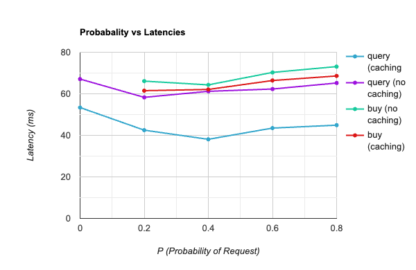

## Deployment on AWS

The services were deployed on an AWS `t2.micro` instance. The following shows an outline of steps followed:
- Get the AWS secrets and permisssions file from the AWS Learners Canvas
- use `aws configure` to set up our local client for access
- start an instance using
 ```aws ec2 run-instances --image-id ami-0d73480446600f555 --instance-type t2.micro --key-name vockey > instance.json```
- Get the public dns name from the instance id in `instance.json` using `aws ec2 describe-instances`. In our case it is `ec2-18-232-173-190.compute-1.amazonaws.com`
- ssh into the instance using `ssh -i labsuser.pem ubuntu@ec2-18-232-173-190.compute-1.amazonaws.com`
- copy our repo to the instance using `scp -r . -i labsuser.pem ubuntu@ec2-18-232-173-190.compute-1.amazonaws.com`
- open the port for our frontend service using `aws ec2 authorize-security-group-ingress --group-name default --protocol tcp --port 34569 --cidr 0.0.0.0/0`
- start all the services on the instance
- start `client.py` on our local instance to issue requests

## Plots
5 Clients were used and the porbabilities were varied from 0 to 0.8. The average latenyc for 100 requests of `query` and `buy` were compared, both with and without caching. The plot is given below:



As can be seen, the biggest improvement by using cache was observed in the `query` requests. Since these don't send any data back to the backend, it is the perfect candidates for using a Cache. Caching also improved performance in `buy` requests, although marginally. As order probability increases, `buy` requests were more affected.


## Answers

#### Can the clients notice the failures (either during order requests or the final order checking phase) or are they transparent to the clients?
Clients cannot notice the failures unless all the replicas are taken offline. This is during both request and checking phase. This is because of the Fault Tolerance mechanism described in [design.md](./design.md).

#### Do all the order service replicas end up with the same database file?
Yes, because of the implementation of Fault Tolerance. An example of this can be seen in [output.md](./output.md)