# Output
# Testing Part 1 and 2
All the tests below were performed using a Cache size of 10, order probability (p) of 0.5 and number of queries per client as 3, unless otherwise mentioned.
## Test 1 Details
We have three order replicas with ids-- \[1,2,3\]. We are starting the
front_end service, catalog service and two order replicas -- id1 and
id2.

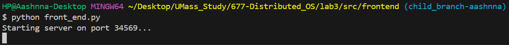

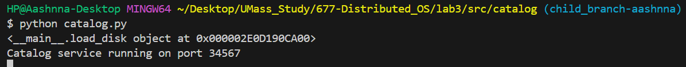

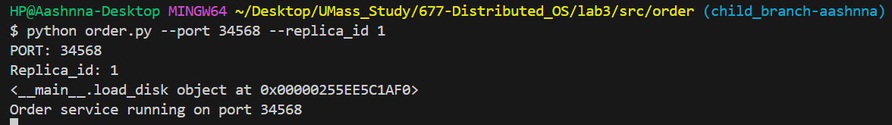

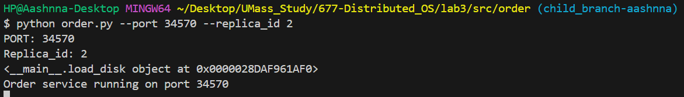

We launched two clients concurrently wherein each client attempts to
make three order requests iteratively.

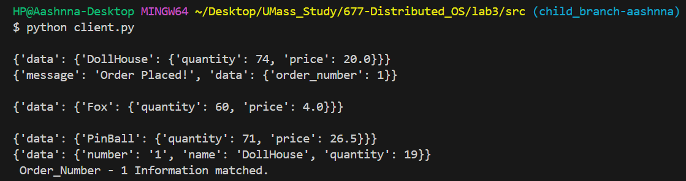

We can observe that client 1 places an order with order number: 1.
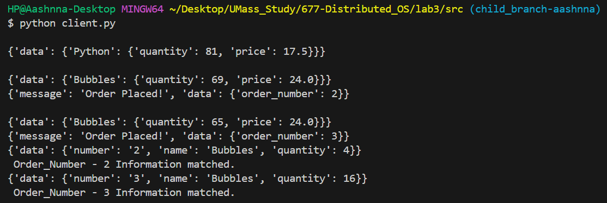
Client 2 places two orders with order numbers 2 and 3. For both clients,
we can see that the order information fetched from the order service and
that stored locally matches successfully.

## Test 2 Details-
**Here, we only launch 1 client to clearly see the implementation
details of the whole application.

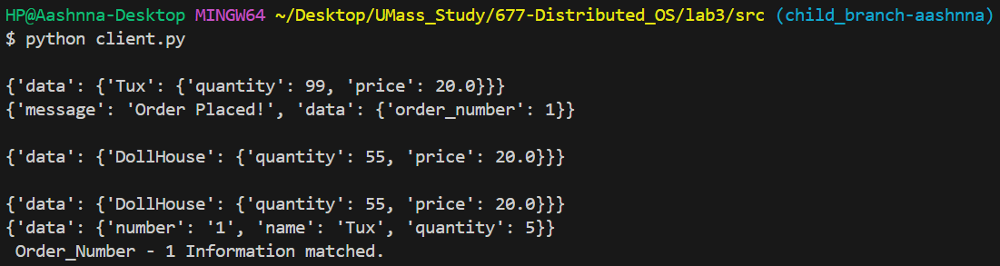

We can observe that the client makes three requests --\
i) it fetches product details for 'Tux' and places an order with order
number 1.\
ii) it fetches product details for 'DollHouse'\
iii) it again fetches product details for 'DollHouse'

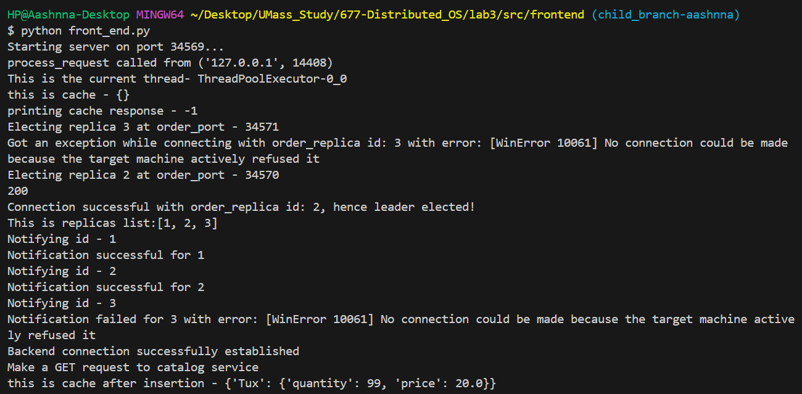

In the front_end implementation, we can clearly observe the caching,
replication and fault tolerance properties.

Upon receiving a request from the client, the front_end first checks if
the product details are mentioned in the **cache**. If not, then it proceeds
with making a GET request to the catalog service to fetch product
details.\
Additionally, the front_end service elects the leader of the order
replicas. It first tries to elect the replicas with highest id i.e 3.
Since the order replica 3 was not active, it then tried electing the
next replica with id =2. Since it successfully made a connection, the
leader election for replica=2 was completed.\
Next, this leader information was sent to all order replicas.

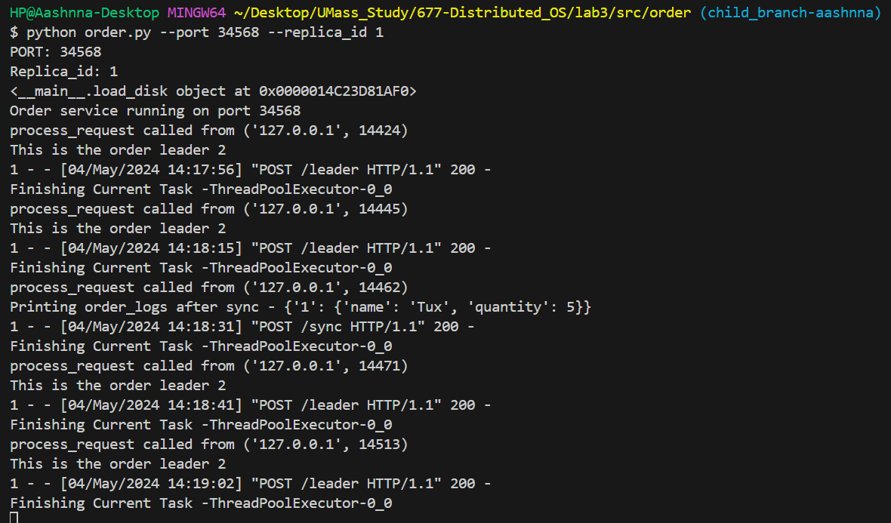

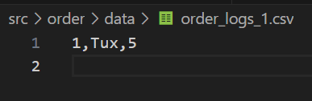
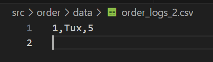

We can observe the same from the order replica 1 logs. Although the
order number=1 was placed with replica id=2, this order information was
successfully synced with order replica 1.

Next, we can observe how caching is implemented at front_end.

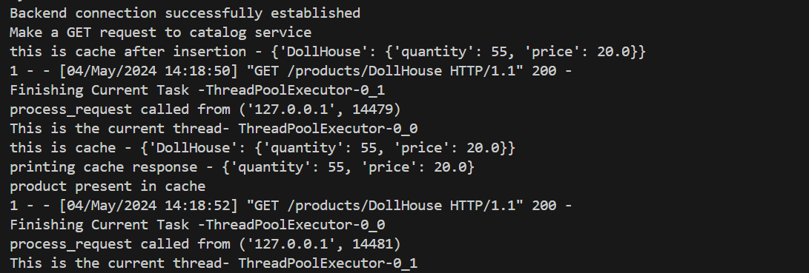

We can see when the client requested information about "DollHouse" the
first time, the product info was not present in cache, hence the
front_end made a GET request to the catalog service to fetch the
details. However, when the client again requested the "DollHouse" info,
this time the details were present in the cache and hence no backend
request was made this time.

Also, whenever the order service restocks or places an order, it sends a
request to the front_end service to remove that product information from
cache.

# Testing Fault Tolerance

For testing Fault tolerance, there are mainly the following scenarios be considered

- When a replica (either leader or non-leader) crashes and restarts, it should sync the orders that it missed
- When the leader crashes, the frontend should elect a new leader to query
- As long as there is atleast one replica alive, the system should be failure-transparent to the client

## Sync on restart
We shall test these scenarios in the following way. We will first start 3 replica order services, kill the leader, while clients are still making orders, and check if the orders are synced on restart

#### Initial startup of 3 replicas

We can see that after 3 replicas are started, `Replica 3` is chosen as the leader. The orders are processed by the leader and sent to the replicas so that they can update their logs.

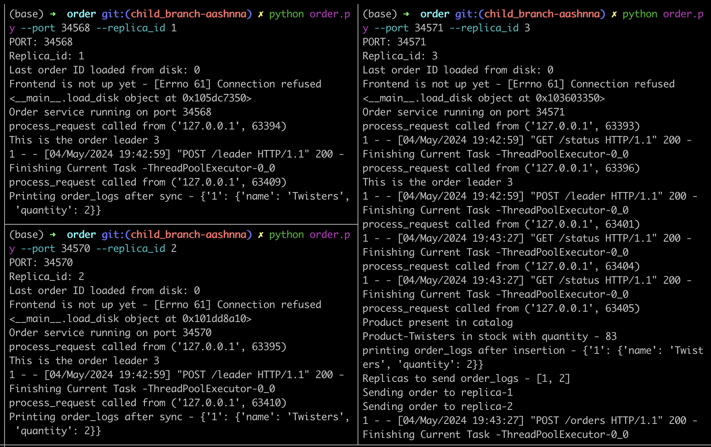
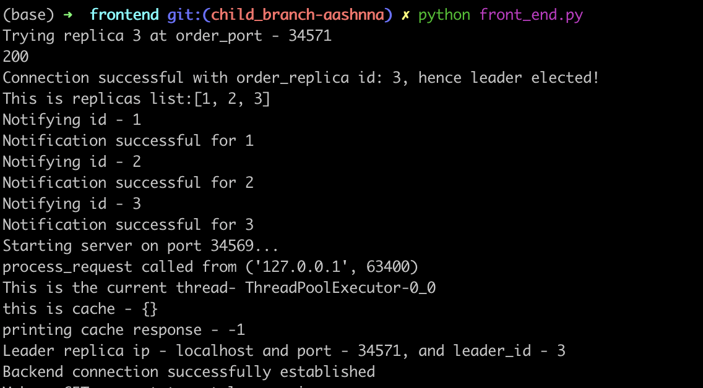

We then kill the leader replica 3, run `client.py` to simulate more orders and restart replica 3.
The following is then observed
- After The leader crashes, the frontend elects the next highest port, Replica 2, as the leader.
- Leader 2 subsequently handles the orders, replicating the info to only Replica 1 (3 is down)
- When Replica 3 is restarted, it checks that it is missing an order from it's catalog and asks the leader, `Replica 2` for the missing orders
- Leader replies and the order is replicated
- when all replicas are shout down, all the three have the same log files.
- This process is repeated, and yet the log files are observed to be in sync.
The server logs in the following screenshots show the above observations

#### Leader Election initially:

#### Replica3 is crashed and client continues ordering:
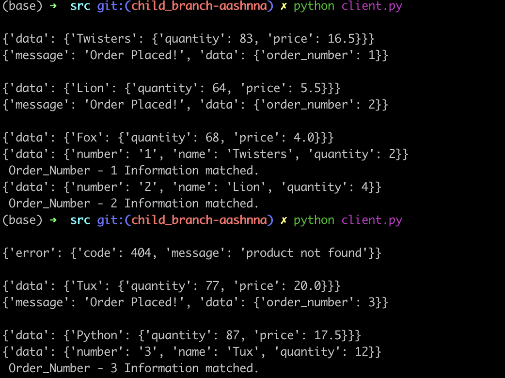
We can see that the failure is transparent to the client and it can continue ordering. (The `404` is because of the lcient querying invalid product, not to do with the replica crash)
#### Leader 2 is elected:
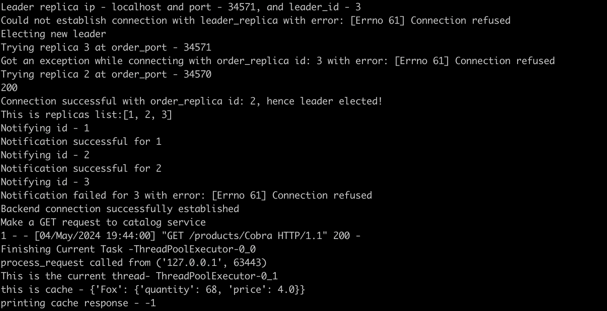
#### Leader 2 syncing with 3:
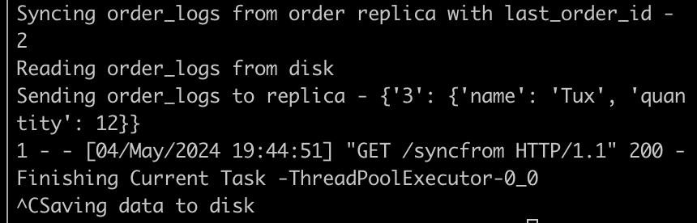
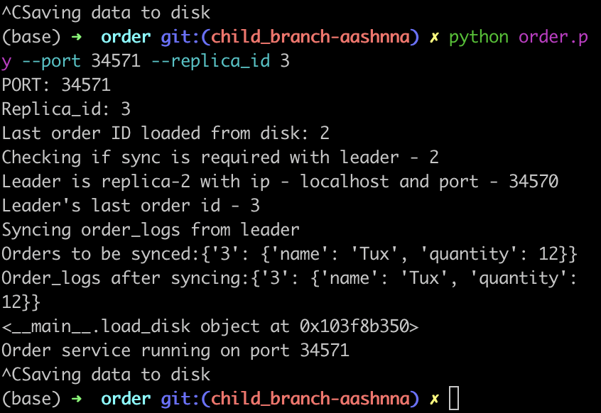
### Logs at the end:
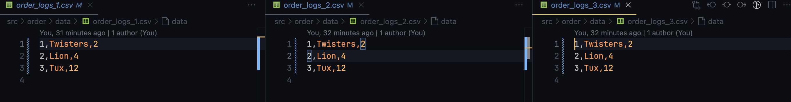

These tests verify that the fault tolerance is working as expected.

# Deployment on AWS
Steps to deploy are listed in [Eval.md](./Eval.md). The screenshot below shows a working system with the `order` replicas, `frontend`, and `catalog` services deployed on an aws `t2.micro` instance. The bottom right panel is the client laptop while the rest are sshed into the instance

